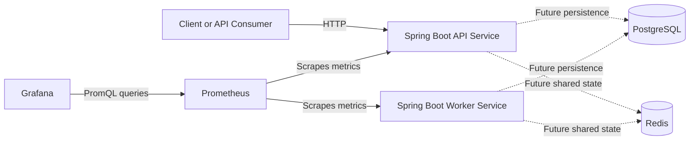
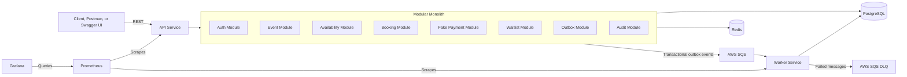

# SlotForge System Overview

## Purpose

SlotForge is an API-first event-booking backend designed to make scarce-resource reservations safe under concurrent demand.

The architecture begins as a modular monolith with a separate worker process. This keeps synchronous domain behavior cohesive while establishing a real process boundary for asynchronous work.

## Current Sprint 0 Topology

During Sprint 0:

- The API and worker are independently runnable Spring Boot applications.
- Both expose health, information, and Prometheus metrics endpoints.
- PostgreSQL and Redis are provisioned locally but are not yet consumed by application code.
- Prometheus scrapes metrics from both Spring Boot services.
- Grafana uses Prometheus as its automatically provisioned datasource.

Dashed lines represent planned integrations rather than currently implemented application behavior.

## Target Architecture

## Service Responsibilities

### API service

The API service owns synchronous, user-facing behavior:

- Authentication and authorization
- Event and session management
- Availability queries
- Booking creation and cancellation
- Payment initiation
- Waitlist operations
- Administrative APIs
- Transactional domain changes

The API service will organize these capabilities as internal modules rather than independently deployed microservices.

### Worker service

The worker service will own asynchronous processing:

- Publishing transactional outbox events
- Booking expiration
- Notifications
- Waitlist promotion
- Payment-event handling
- Retry and dead-letter queue behavior

Message handlers must eventually be idempotent because queue delivery can occur more than once.

### Shared module

The shared module is limited to stable cross-process concerns:

- Event envelope definitions
- Event payload contracts
- Shared identifiers
- Small utilities with no service-specific behavior

It must not contain controllers, repositories, or unrelated business logic. Keeping this module narrow reduces coupling between the API and worker.

## Communication Model

Synchronous client operations use REST.

Asynchronous workflows will use versioned events through AWS SQS. The transactional outbox pattern will ensure that database state and intended event publication are recorded atomically before external delivery.

The API and worker must not invoke each other's internal implementation directly.

## Data Ownership

PostgreSQL is the authoritative source of durable domain state.

Redis will provide shared, non-authoritative state for capabilities such as caching and distributed rate limiting. Correctness must not depend exclusively on cached data.

Prometheus stores operational time-series metrics. Grafana queries those metrics but is not itself a metric store.

## Local Development

Docker Compose provides:

- PostgreSQL
- Redis
- API service
- Worker service
- Prometheus
- Grafana

Compose service names provide DNS discovery inside the local network. For example, Prometheus reaches the API through `api:8080`, while a developer reaches it through `localhost:8080`.

## Design Principles

- Prefer correctness over feature count.
- Keep synchronous domain logic cohesive.
- Introduce distributed boundaries only when they serve a clear purpose.
- Make duplicate requests and message delivery safe.
- Treat PostgreSQL as the source of truth.
- Keep shared code intentionally small.
- Expose operational health and metrics from the beginning.
- Validate distributed-system claims with multi-replica testing.