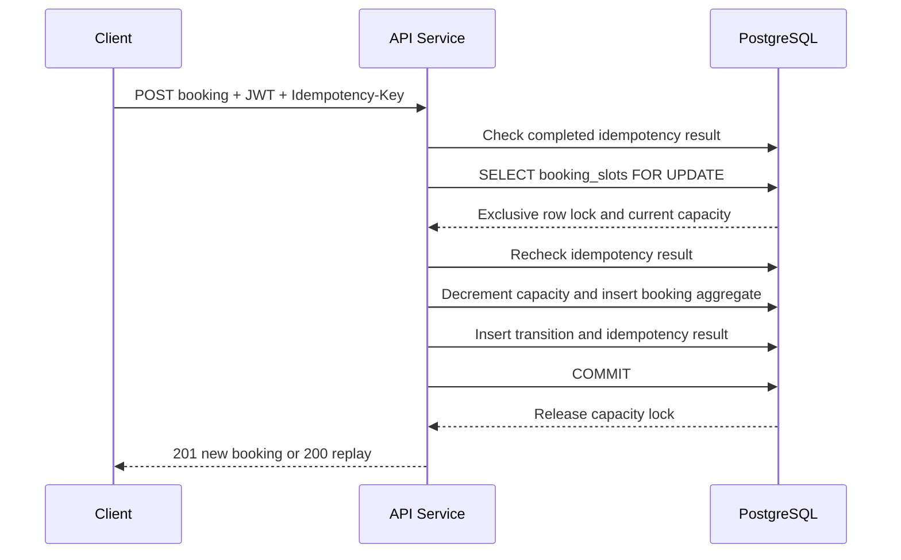
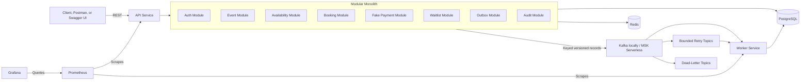

# SlotForge System Overview

## Purpose

SlotForge is an API-first event-booking backend designed to make scarce-resource
reservations safe under concurrent demand. It uses a modular monolith for
synchronous domain behavior and a separately deployable worker for future
asynchronous workflows.

## Current Sprint 3 Topology

```mermaid
flowchart LR
    Client[Client, Postman, or Swagger UI] -->|REST + JWT| API[Spring Boot API Service]

    subgraph APIProcess[Current Modular Monolith]
        Auth[Auth and RBAC]
        Events[Events, Venues, Sessions]
        Availability[Capacity and Availability]
        Booking[Bookings, Idempotency, State History]
        Audit[Audit Logging]
    end

    API --> APIProcess
    APIProcess -->|Transactions and row locks| PostgreSQL[(PostgreSQL)]

    Prometheus[Prometheus] -->|Scrapes metrics| API
    Prometheus -->|Scrapes metrics| Worker[Worker Service Shell]
    Grafana[Grafana] -->|PromQL queries| Prometheus

    APIProcess -. Sprint 7 cache and rate limits .-> Redis[(Redis)]
    APIProcess -. Sprint 5 outbox records .-> Kafka[Apache Kafka]
    Kafka -. Sprint 5 consumption .-> Worker
    Worker -. Future async state .-> PostgreSQL
```

Solid arrows describe implemented behavior. Dashed arrows are provisioned or
planned integrations whose application workflows have not yet been implemented.

At Sprint 3:

- PostgreSQL stores identity, refresh tokens, events, sessions, capacity,
  bookings, allocations, state transitions, idempotency records, and audit logs.
- The API performs JWT authentication, RBAC, ownership checks, concurrency-safe
  booking, idempotent retry handling, and atomic cancellation.
- Redis is locally provisioned but is not an application correctness dependency.
- The worker is independently runnable but does not yet consume Kafka records.
- Kafka and the transactional outbox begin in Sprint 5.

## Current Synchronous Booking Path

PostgreSQL is the concurrency boundary. No booking correctness guarantee relies
on an in-process Java lock, so the design can later be validated across multiple
API replicas.

## Target Architecture

## Service Responsibilities

### API service

The API service owns synchronous, user-facing and transactional behavior:

- Registration, login, refresh-token rotation, logout, JWT validation, and RBAC
- Event, venue, session, and availability APIs
- Booking creation, retrieval, listing, transition history, and cancellation
- Pessimistic scarce-capacity decisions
- Client-request idempotency and concurrent duplicate recovery
- Ownership checks and sensitive-action auditing
- Future payment, waitlist, and transactional-outbox writes

### Worker service

The worker service will own asynchronous processing beginning in Sprint 5:

- Outbox publication to Kafka
- Notification simulation
- Payment-event processing
- Waitlist promotion
- Retry and dead-letter handling
- Idempotent event consumption

Booking expiry will use a database-backed scheduler over persisted expiry
timestamps rather than treating Kafka as a delayed-message scheduler.

### Shared module

The shared module is reserved for stable cross-process contracts and small
utilities. It must not contain controllers, repositories, or API-service domain
implementation. Event envelopes will include identifiers, type, version,
timestamp, correlation metadata, aggregate identity, and payload.

## Communication and Consistency

Clients use synchronous REST. PostgreSQL transactions provide atomicity for
current domain changes. Booking capacity uses a pessimistic row lock; booking
cancellation combines optimistic booking-state detection with pessimistic shared
capacity locking.

Future asynchronous workflows will use a transactional outbox and Apache Kafka.
Publication and consumption will be at least once, so record keys, event schema
versions, consumer groups, processed-event constraints, retries, and dead-letter
handling must be explicit.

## Data Ownership

PostgreSQL is the authoritative source of durable domain state. Redis will hold
shared but non-authoritative cache and rate-limit state. Kafka will retain event
records for asynchronous workflows; it will not replace the transactional system
of record.

Prometheus stores operational time series. Grafana queries Prometheus and does
not own application state.

## Local Development

Docker Compose provides PostgreSQL, Redis, the API, worker, Prometheus, and
Grafana. Kafka will be added in KRaft mode for Sprint 5. Compose service names
provide internal DNS; developers access published ports through `localhost`.

Integration tests use PostgreSQL Testcontainers so Flyway, constraints,
transactions, and row-lock behavior are exercised against the target database
engine rather than an in-memory substitute.

## Validated and Deferred Claims

Sprint 3 integration tests validate zero overbooking for concurrent requests
against one local API instance, idempotent duplicate handling, ownership, and
exactly-once capacity restoration during cancellation.

The project does not yet claim multi-replica validation, Kafka delivery
guarantees, Redis-global rate limiting, payment reconciliation, or waitlist
correctness. Those claims require their scheduled implementation and tests.

## Design Principles

- Prefer correctness over feature count.
- Keep synchronous domain logic cohesive.
- Use PostgreSQL as the source of truth and concurrency boundary.
- Make retries safe and state transitions explicit.
- Keep transactions short while holding scarce-resource locks.
- Introduce distributed boundaries only with tested delivery semantics.
- Keep shared code intentionally small.
- Validate multi-replica claims with multi-replica tests.
